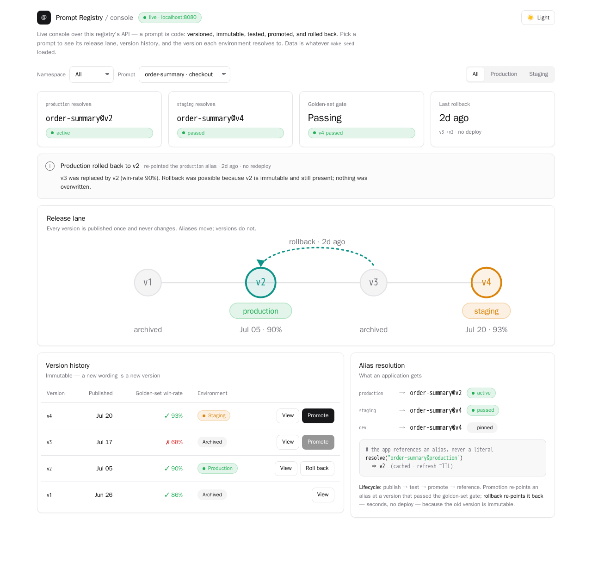
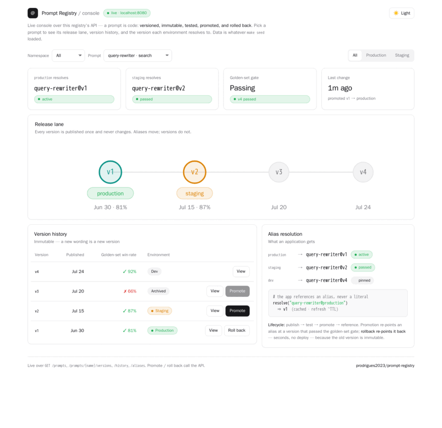

# Prompt Registry

> Prompts são código que vai para produção — então versione, teste, promova e faça rollback como
> código. Um registry que trata um prompt como artefato de primeira classe, não como uma string num
> arquivo de código. Documentado primeiro, implementado em público.

[](./ROADMAP.md)
[](./docs/adr)
[](./LICENSE)

Um prompt é a linha que mais muda o comportamento de uma aplicação de IA, e costuma ser a menos
"engenheirada". Ele vive como um literal de string dentro de uma função, editado no lugar,
implantado junto com o código, sem versão que alguém consiga nomear, sem teste que pegue uma
regressão, e sem forma de reverter o que quebrou produção sem um redeploy.

Enquanto isso, todo mundo trata o *código* ao redor do prompt com rigor total — revisado, versionado,
testado, promovido entre ambientes. O prompt, que muda o comportamento mais do que esse código,
não recebe nada disso. Este repositório fecha essa lacuna: um prompt é um artefato versionado com
identidade, suíte de testes, caminho de promoção e rollback — a mesma disciplina que o resto da
aplicação já tem.

**English:** [README.md](./README.md)

---

## O que já existe

| Área | Status | Link |
| --- | --- | --- |
| Contexto e escopo | Pronto | [docs/context.md](./docs/context.md) |
| Diagramas de ciclo de vida | Pronto | [docs/diagrams](./docs/diagrams) |
| Protótipo de UI (mockup de design) | Pronto | [▶ demo ao vivo](https://prodrigues2023.github.io/prompt-registry/prototype/) · [fonte](./docs/prototype) |
| Console ao vivo (dashboard) | Pronto | [O console](#o-console) · servido em `/` |
| Registros de Decisão de Arquitetura | 7 publicados | [docs/adr](./docs/adr) |
| Por que prompts são código | Pronto | [docs/prompts-are-code.md](./docs/prompts-are-code.md) |
| Contratos — schema do artefato, formato de referência, contrato de teste | Pronto, escrito após M3/M4 | [docs/contracts](./docs/contracts) |
| Registry (API, client, consumer) | Pronto — Fase 3 | [Rodando localmente](#rodando-localmente) · [src](./src) |
| Harness de regressão (golden set → gate) | Pronto — Fase 4 | [O gate](#testando-uma-mudança-de-prompt--o-gate) · [src](./src/PromptRegistry.Harness) |

## O console

O registry serve um dashboard ao vivo em `http://localhost:8080/` — escolha um prompt para ver sua
faixa de release, o histórico de versões, e qual versão cada ambiente resolve. Promover e reverter
chamam a API. Abaixo: `checkout.order-summary` depois que um `v3` ruim foi revertido para o `v2`
imutável.



Promover e reverter são uma única operação e têm efeito sem redeploy — aqui o `v4` é promovido para
produção, depois revertido para o `v1` imutável, e a faixa de release, os KPIs, e a resolução de
alias acompanham tudo:



## A ideia

**Um prompt em produção tem uma versão, e a aplicação o referencia por nome, não por literal.** No
momento em que um prompt tem identidade estável — um nome e uma versão — tudo que o código já faz se
torna possível: testar aquela versão antes de subir, promovê-la de staging para produção, e reverter
para a versão anterior em segundos sem tocar na aplicação. O registry é o que dá ao prompt essa
identidade.

Tudo [nos ADRs](./docs/adr) decorre de tratar um prompt como artefato versionado em vez de string.

## Rodando localmente

Um comando sobe o registry e o Postgres; as migrations aplicam na inicialização.

```bash
make up         # build + inicia o registry em http://localhost:8080
make demo       # publica, testa, promove, bloqueia uma regressão, reverte — de ponta a ponta
make regression # roda o harness de golden set: uma regressão pega bloqueia uma promoção
make drills     # drills de consistência de frota + fallback (autocontidos, sem servidor)
make app        # roda o consumer de exemplo que resolve prompt://checkout-summary@production ao vivo
make down       # para tudo e derruba o volume
```

`make demo` percorre todo o ciclo de vida contra o registry rodando e imprime cada passo: uma
versão é publicada e testada, promovida de staging → produção, um v2 cujo teste de golden set
**falha é bloqueado no gate** (HTTP 409), e uma promoção forçada-e-ruim é **revertida em uma única
operação**. As peças:

| Projeto | Papel |
| --- | --- |
| [`PromptRegistry.Core`](./src/PromptRegistry.Core) | O domínio: versão imutável, referência `prompt://name@env`, hash de conteúdo |
| [`PromptRegistry.Api`](./src/PromptRegistry.Api) | Store append-only, promote/rollback como movimento de alias, endpoint de resolução |
| [`PromptRegistry.Client`](./src/PromptRegistry.Client) | Resolve-by-alias com cache TTL, serve-stale, e fallback de cold-start empacotado |
| [`PromptRegistry.Harness`](./src/PromptRegistry.Harness) | `promptcheck`: roda o golden set, compara com o baseline por slice, escreve o gate |
| [`PromptRegistry.Drills`](./src/PromptRegistry.Drills) | `drills`: os drills de validação autoafirmativos — tempo de rollback, consistência de frota, fallback |
| [`CheckoutSummarizer`](./samples/CheckoutSummarizer) | Um consumer de exemplo que conhece só a referência — nunca um literal de versão |

O store é **append-only**: uma versão publicada nunca é mutada, então um rollback é um movimento de
ponteiro em vez de um redeploy, e um resultado de teste fica atado exatamente aos bytes que ele
avaliou.

## Testando uma mudança de prompt — o gate

`make regression` roda o harness que decide uma promoção para que um spot-check humano não precise.
Ele materializa a [ADR-0004](./docs/adr/0004-regression-testing.md): o teste é **comparativo** (a
candidata é pelo menos tão boa quanto a versão que substituiria?), pontuado por **propriedades**,
não saída exata, avaliado **por slice** para que uma mudança que degrade uma classe de entradas
falhe, e rodado várias vezes por caso porque o modelo é não-determinístico.

```bash
promptcheck --prompt checkout-summary --candidate 2 \
            --golden samples/golden/checkout-summary.golden.json --gate
```

Uma reescrita que "lê melhor, mas silenciosamente derruba o número do pedido e o total" é
exatamente a mudança que um spot-check deixa passar. O harness pega:

```
slice              candidate    baseline     delta   verdict
completeness            0.0%      100.0%   -100.0%   REGRESSED
edge                  100.0%      100.0%     +0.0%   ok
typical               100.0%      100.0%     +0.0%   ok
FAIL: Regression on slice(s) completeness ...
```

Com `--gate` o veredito é escrito de volta na versão, e um gate que falha **bloqueia a
promoção** — a regressão nunca chega em produção. A avaliação roda contra um **modelo stub
local** (sem conta de nuvem, pela restrição de "roda no laptop"); a metodologia, não o stub, é o
ponto. *Como* pontuar uma versão como melhor que outra é do
[rag-evaluation-toolkit](https://github.com/prodrigues2023/rag-evaluation-toolkit) — este registry
**executa** esse julgamento como um gate.

## Drills de validação

Três drills provam as promessas que o registry faz sobre falha e recuperação, cada um
autoafirmativo, então funcionam como testes também — *mostrado, não afirmado*:

| Drill | O que prova | Rodar |
| --- | --- | --- |
| **Rollback** | Um rollback chega a um consumer rodando dentro do TTL do cache — segundos, sem redeploy | `make rollback-drill` (precisa de `make up`) |
| **Consistência de frota** | Duas instâncias discordam brevemente durante um refresh, depois convergem — a consistência é eventual, limitada pelo TTL | `make fleet-drill` |
| **Fallback** | Uma indisponibilidade do registry degrada para a versão empacotada (cold start) ou a última-boa-conhecida (warm), nunca uma falha dura | `make fallback-drill` |

Os drills de frota e fallback são autocontidos (um registry falso em processo, sem servidor); o
drill de rollback mede a propagação real contra um registry rodando. Saída de exemplo:

```
rollback issued -> consumer served v1 again after 1011 ms
bounded by the 1s consumer cache TTL — no application redeploy, no restart.
```

## Por que documentar primeiro

As decisões caras são as que viram contratos. Como uma versão de prompt é identificada, como uma
aplicação a referencia, o que "o prompt mudou" significa para a versão — cada uma passa a sustentar
tudo no instante em que uma aplicação depende do registry, e mudá-la depois quebra toda aplicação que
referencia um prompt. E a pergunta mais difícil — como testar uma mudança em um componente
não-determinístico — é uma decisão de metodologia que molda todo o registry, e é muito mais barata de
raciocinar no papel do que de retrofitar.

> Os documentos técnicos são mantidos em inglês para alcançar o público mais amplo possível.
> Este README traz o contexto em português.

## Roadmap

Quatro fases, acompanhadas como milestones no GitHub. Detalhes em [ROADMAP.md](./ROADMAP.md).

1. **Design** — contexto, diagramas de ciclo de vida, ADRs, o argumento de que prompts são código — concluído
2. **Contratos** — o artefato de prompt, o formato de referência, o contrato de teste — concluído,
   escrito após os Milestones 3 e 4 já estarem prontos; veja
   [ADR-0006](./docs/adr/0006-prompt-artifact-and-reference-format.md) para o porquê
3. **Registry** — o store, o fluxo de promoção, uma integração de exemplo — concluído
4. **Validação** — testes de regressão contra um golden set, drills de rollback — concluído

## Relacionados

- [enterprise-ai-framework](https://github.com/prodrigues2023/enterprise-ai-framework) — o framework cuja decisão planejada de versionamento de prompt este registry aprofunda
- [rag-evaluation-toolkit](https://github.com/prodrigues2023/rag-evaluation-toolkit) — como uma mudança de prompt é julgada melhor ou pior, que é o que gateia uma promoção
- [ai-solution-architecture-kit](https://github.com/prodrigues2023/ai-solution-architecture-kit) — onde o controle de mudança de prompt se encaixa na certificação de modelos e na revisão

## Autor

Paulo Roberto Franco Rodrigues — AI Solutions Architect.
Recentemente projetou frameworks corporativos de IA e atuou em comitê de arquitetura de IA definindo
os padrões de engenharia que trazem disciplina de software para a entrega de IA.
[LinkedIn](https://linkedin.com/in/paulo-roberto-franco-rodrigues)

## Licença

MIT — veja [LICENSE](./LICENSE).
