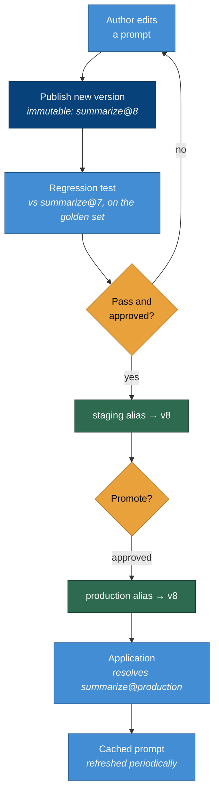
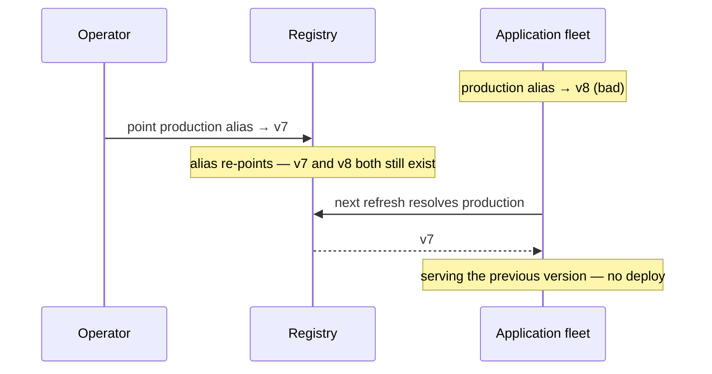

# Prompt lifecycle

## Version, test, promote, reference

**A version is published once and never changes** ([ADR-0002](../adr/0002-prompt-as-artifact.md)).
Everything after — the test, the aliases, the application — refers to that fixed `summarize@8`. The
test is comparative, against the version it would replace
([ADR-0004](../adr/0004-regression-testing.md)); promotion is re-pointing an alias at the version
that passed ([ADR-0003](../adr/0003-promotion.md)); the application resolves an environment alias,
never a literal ([ADR-0005](../adr/0005-referencing-and-rollback.md)).

**This is the code lifecycle.** Publish is commit, the regression test is CI, promotion is release,
and the alias is a feature flag — applied to the one artifact that usually has none of them.

---

## Rollback — the capability that justifies the registry

Production is on a bad version. Here is the whole recovery.

**Rollback is one registry operation, and it takes effect on the next refresh** — seconds, not a
release ([ADR-0005](../adr/0005-referencing-and-rollback.md)). It is possible only because v7 is
still there, unchanged ([ADR-0002](../adr/0002-prompt-as-artifact.md)) — you cannot roll back to a
version an edit overwrote.

**Contrast the embedded-prompt rollback:** revert the code change, get it reviewed, rebuild, redeploy
— minutes to hours, during which the bad prompt is live for every user. The registry turns that into
re-pointing an alias. That single difference is the strongest argument for the whole repository.

---

## The honest caveats, on the diagram

Two things the arrows understate:

- **The refresh is a delay.** "Next refresh" is up to one refresh interval, so rollback is fast, not
  instant, and different instances briefly disagree ([ADR-0005](../adr/0005-referencing-and-rollback.md)).
- **The gate is only as strong as the golden set behind the test**
  ([ADR-0004](../adr/0004-regression-testing.md)). A green test on a weak set is a promotion with
  nothing behind it — the structure guarantees a checkpoint, not that the checkpoint is meaningful.
